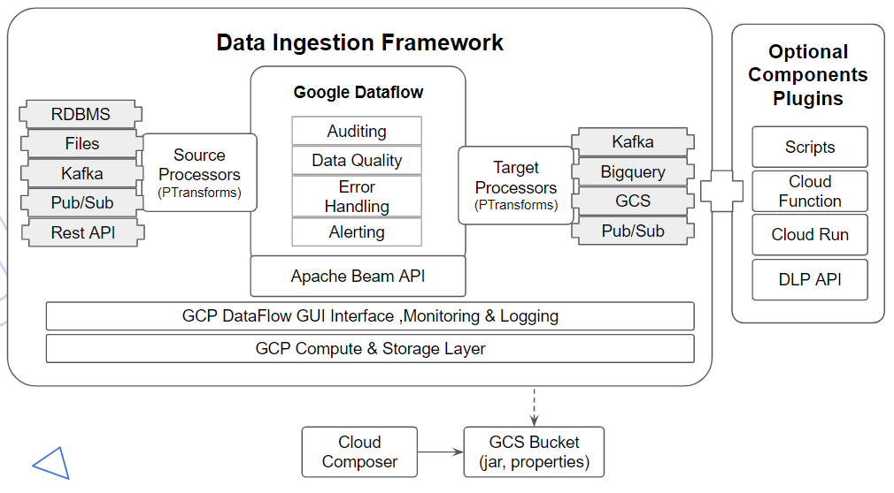
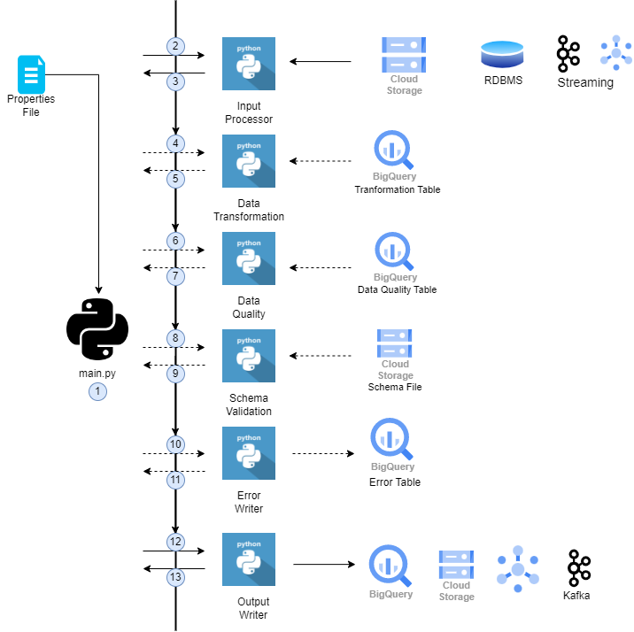
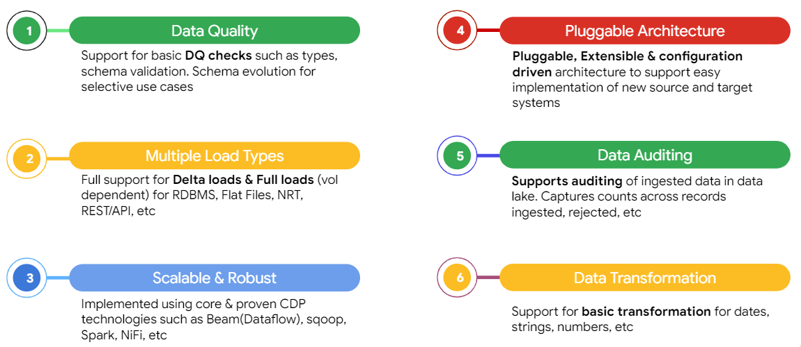
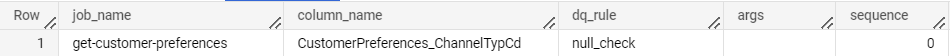
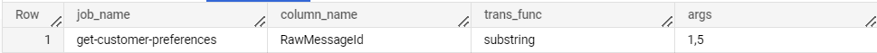
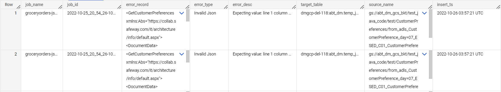
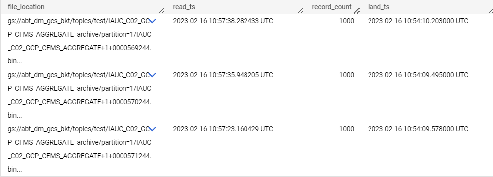
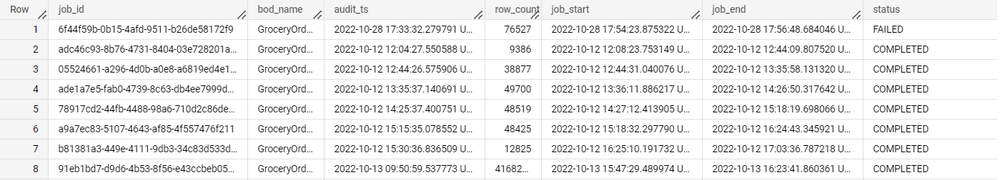
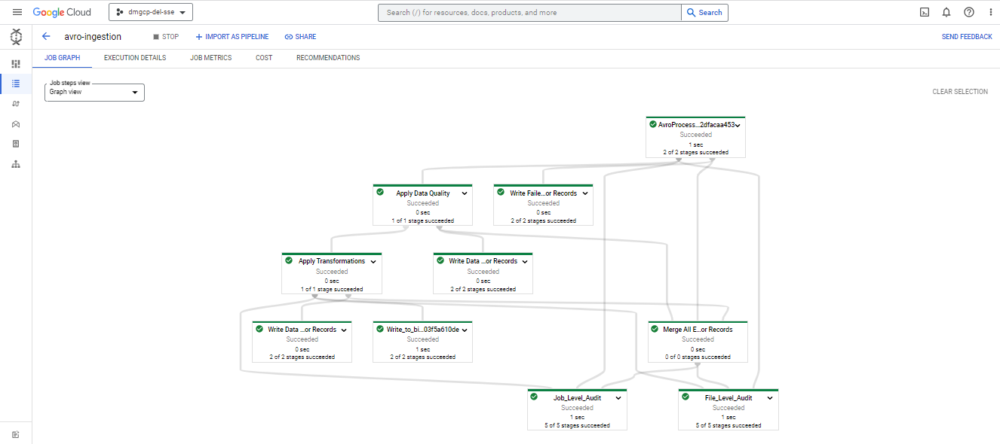

# Dataflow Data Ingestion Framework (DIF)

## Introduction:

The Data Ingestion Framework allows common functionalities like data extraction, ingestion using metadata driven
approach using config files. This framework is built in python using Dataflow and Apache Beam SDKs.

## High Level Architecture:

## Codeflow:

## Features:

- DIF provides some column level customizations like  

    - _Data Quality_  
      Column Level Data Quality checks like isNull, rangeConstraint, valuesLike etc. ; can be configured in the DQ
      specific metadata table (name configurable from property files). These are applied on the column data on the
      fly.  
      The records which don’t conform to the DQ checks are pushed to the error/exception table(name configurable from
      property files).
    - _Data Transformation_  
      Basic Column Level Data Transformations like nullToEmpty, epochToTimestamp, ifElseConditions etc. ; can be
      configured in the Transformation metadata table. These are applied on the column data on the fly.
    - _Schema Conformance_  
      The datatype for the record(columns) can be checked on the fly; using the Target BQ table Schema.  
      The records which don’t conform to the Schema Conformance __are pushed to the error/exception table (name
      configurable from property files).  
      For Instance: if the string data is sent by the source, to be pushed inside the Integer column in Bigquery

- The Framework supports both Full load and Delta load.

- The Framework is Pluggable, extensible and configuration based; and easily supports adding in new sources and targets.

- The DIF uses Cloud Dataflow as a Runner, which is google cloud managed service with Horizontal and vertical scaling
  support.

- The DIF also incorporates data auditing; Job runs, records counts (valid / invalid) are audited into the Bigquery
  audit tables.

## Setting up DIF:

### Prerequisites:

The DIF is created on the apache beam framework, written in Python Language and being run using the Dataflow Runner. As
a pre-requisites the Dataflow needs some roles/access to be able to run, apart from the user/service(composer) which
would again need some roles/access to be able to trigger dataflow.

The Below documents talks more about the roles/access/service account.

[Prerequisite Documentation](https://docs.google.com/document/u/0/d/1ggkCRfcD73kJRQ5ezv--NyZt-wDn0GNprdm3n4Q5aMk/edit)

#### Set up with GIT:

Clone the repository:

    git clone 

Navigate to the directory where you downloaded the repository

    cd DataIngestionFramework

## Property Files Overview:

Data Ingestion Framework (DIF) is a metadata driven framework and expects input in two types of input files for
execution,

1. Job Property YAML - This file consists of all the Dataflow Properties, Error Table, Audit Table Details, RDBMS
   Properties (If using RDBMSProcessor). This is a common property file and can be used for multiple jobs with same
   source type (example - running multiple table ingestion jobs against same RDBMS source)
2. Task Property YAML - This file consists of table/file level ingestion details, such as file name (if using file-type
   ingestion), table details (if using RDBMS ingestion), data quality, data transformation, etc.

### Job Property File:

Job properties are the properties that define your dataflow pipeline and don’t need to change for every task, you can
store this yaml file in your local machine or in a gcs bucket. This is a dataflow level job properties file containing
common properties like runner, region, autoscaling_algorithm, save_main_session, temp_location, staging_location, etc.

|               |              |          |                                    |
|:-------------:|:------------:|:--------:|:----------------------------------:|
|  **Content**  | **Required** | **Type** |          **Description**           |
| dataflow_prop |     True     |   dict   | All necessary data flow properties |
|     error     |    False     |   dict   |     Error handling properties      |
|     audit     |    False     |   dict   |          Audit properties          |

**Note: Sample Property Files can be found under the resources' folder.**

### Task Property File:

Task property file is a yaml file which consists of a list of tasks under the tag tasks as there can be multiple
processors working at the same time. Consider having one task property file for each table you would ingest from a
database.

|                           |              |          |                                                    |
|:-------------------------:|:------------:|:--------:|:--------------------------------------------------:|
|        **Content**        | **Required** | **Type** |                  **Description**                   |
|         job_name          |     True     |  string  |                      Job name                      |
|         task_name         |     True     |  string  |                     Task name                      |
|      input_processor      |     True     |  string  |         Processor to be used for ingestion         |
|       job_prop_file       |     True     |  string  |            Job properties for pipeline             |
|      input_file_path      |     True     |  string  | Location of source if ingestion type is file-based |
|        topic_name         |    False     |  string  |        Kafka topic name if source is Kafka         |
|      column_name_map      |    False     |  string  |        Column mapping for renaming columns         |
|     file_audit_table      |    False     |  string  |               Table ID for auditing                |
| is_filename_req_in_target |    False     |  string  |                    Source name                     |
|       data_quality        |    False     |   dict   |              Data quality properties               |
|    data_transformation    |    False     |   dict   |           Data transformation properties           |
|          targets          |     True     |   dict   |                      Targets                       |

**Note: Sample Property Files can be found under the resources folder.**

## Processor Types and Configuration:

### File Based Ingestion:

#### Delimited:

Prerequisite:

- Need to Provide Schema File, if file does not consist of headers as first row.
- Need to Provide Delimiter in Task Property File (By Default “,” will be considered)
- Files need to be placed in Google Cloud Storage Bucket which should be accessible to the Dataflow Service Account.

Sample Property Files:

- Sample Property Files can be found under the Delimited Folder in resources folder.

#### Avro:

Prerequisite:

- Files need to be placed in Google Cloud Storage Bucket which should be accessible to the Dataflow Service Account.

Sample Property Files:

- Sample Property Files can be found under the Avro Folder in resources folder.

#### Parquet:

Prerequisite:

- Files need to be placed in Google Cloud Storage Bucket which should be accessible to the Dataflow Service Account.

Sample Property Files:

- Sample Property Files can be found under the Parquet Folder in resources folder.

#### JSON:

Prerequisite:

- Files need to be placed in Google Cloud Storage Bucket which should be accessible to the Dataflow Service Account.

Sample Property Files:

- Sample Property Files can be found under the JSON Folder in resources folder.

#### NDJSON:

NDJSON, or Newline Delimited JSON, is a simple and lightweight data interchange format where each JSON object is stored
on a separate line, allowing for easy parsing and streaming of individual records

Prerequisite:

- Files need to be placed in Google Cloud Storage Bucket which should be accessible to the Dataflow Service Account.

Sample Property Files:

- Sample Property Files can be found under the NDJSON Folder in the resources folder.

#### JSON Flatten (Batch/Streaming):

The incoming Json data is read and then flattened and the flattened columns are renamed according to the column name map
provided by the user from task property file using column_name_map tag.  
By flattening, we can put all nested properties extracted and organized into a single level.

Prerequisite:

- Need to provide column name map with nested column names and BQ column name.
- Files need to be placed in Google Cloud Storage Bucket which should be accessible to the Dataflow Service Account.

Sample Property Files:

- Sample Property Files can be found under the JSON Flatten Folder in the resources folder.
- Sample Mapping File can also be found under the JSON flatten Folder in the resources folder.

### RDBMS Ingestion:

#### Full Load:

Prerequisite:

- Dataflow workers should have access to RDBMS.
- You will have to provide credentials, driver classpath for Dataflow to connect to RDBMS in Job Property File
- Specify the table and schema name/query in the Task Property File.

Sample Property Files:

- Sample Property Files can be found under the RDBMS Full load Folder in the resources folder.

#### Incremental Load:

Prerequisite:

- Dataflow workers should have access to RDBMS.
- You will have to provide credentials, driver classpath for Dataflow to connect to RDBMS in Job Property File
- Specify the table and schema name/query in the Task Property File.- For Incremental load to work, there has to be an
  incremental column in the table. You will have to
  specify incremental column name and column type in
  the Task Property File.

Note: Currently supported Column Types are Integer, Timestamp, Date, Datetime.

Sample Property Files:

- Sample Property Files can be found under the RDBMS Incremental load Folder in the resources folder.

#### Large Volume Data load in Splits:

When there is large data which needs to be ingested, to fully utilise parallelism and concurrent data extraction we have
a provision in DIF to load the data based on a column which has data that can be used as splits.

To achieve this, we create multiple queries with WHERE condition based on the column type and values.

Prerequisite:

- Dataflow workers should have access to RDBMS.
- You will have to provide credentials, driver classpath for Dataflow to connect to RDBMS in Job Property File
- Specify the table and schema name/query in the Task Property File.- For loading large data in splits (parallelly), we
  will need a column with splittable values like
  integer values or timestamp values.

Note: Currently supported Column Types are Integer, Timestamp, Date, Datetime.

Sample Property Files:

- Sample Property Files can be found under the RDBMS Splits load Folder in the resources folder.

### Streaming Ingestion:

#### Kafka (JSON/Avro):

Prerequisite:

- Dataflow workers should have access to Kafka.
- You will have to provide bootstrap server, group id, topic name in Task Property File.
- Also, supported Data formats are JSON and Avro, you will have to specify source data format in the Task Property File.

Sample Property Files:

- Sample Property Files can be found under the Kafka Folder in the resources folder.

#### Pubsub (JSON/Avro):

Prerequisite:

- Dataflow workers should have access to PubSub API.
- You will have to provide a subscription path in the Task Property File.
- Also, supported Data formats are JSON and Avro, you will have to specify source data format in the Task Property File.

Sample Property Files:

- Sample Property Files can be found under the Pubsub Folder in the resources folder.

### Data Warehouse Ingestion:

#### Snowflake:

Prerequisite:

- Dataflow workers should have access to Snowflake DWH.
- You will have to provide staging_bucket_name, storage_integration, warehouse, role in a JSON format in a secret
  manager value. The secret manager address needs to be specified in the Job Property File.
- In the Task Property File, we will have to specify the query, schema, database, snowflake_table.

Sample Property Files:

- Sample Property Files can be found under the Snowflake Folder in the resources folder.

#### Teradata (RDBMSProcessor):

Refer to RDBMS Source.

Prerequisite:

- Dataflow workers should have access to Teradata.
- You will have to provide credentials, driver classpath for Dataflow to connect to Teradata in Job Property File
- Specify the table and schema name/query in the Task Property File.

Sample Property Files:

- Sample Property Files can be found under the Teradata Folder in the resources folder.

### API Ingestion:

#### API

Prerequisite:

- You will have to provide the API Path and query params in the Task Property File.
- If the API is public, no need to provide authentication. Else, you will have to provide headers.

Sample Property File:

- Sample Property Files can be found in the API Folder in the resources folder.

## Data Quality Configuration:

Data quality is a critical aspect of any data ingestion framework, as it directly impacts the accuracy and usefulness of
the data being ingested.

The pipeline dynamically retrieves data quality rules from a designated BigQuery table and systematically applies them
to the data being processed, ensuring that the data meets the predefined quality standards.

To enable Data Quality, we will have to add data_quality tag in Task Property File and add data_quality_enabled,
data_quality_rule_table in the tag.

The data_quality_enabled tag needs to be set True and you have to specify the DQ table name in data_quality_rule_table
with the below given schema.

Note: The name of the table can be user defined.

Current framework has the following Data Quality checks:

- length_equals
- null_check
- empty_check

However, if we want to add more Data quality checks, we can navigate to class **DqFunctions** inside dq_functions.py
which is placed inside the **utility** python package and add a data quality @staticmethod.

For instance, if we wish to add a DQ check where we expect to value to have a length constraint of n.

we can write a function:

    @staticmethod
    def length_constraint(value, args):
        try:
            expected_length = int(args)
            if len(str(value)) <= expected_length:
                return True        
            else:
                return False    
        except DqException as ex:
            return False

After this, we can add a row in the data_quality_rule table on a specific column.

### Data Quality Table Schema:

|              |          |          |                                          |
|:------------:|:--------:|:--------:|:----------------------------------------:|
| **fullname** | **mode** | **type** |             **description**              |
|   job_name   | NULLABLE |  STRING  |        name of your data flow job        |
| column_name  | NULLABLE |  STRING  | column name on which DQ is to be applied |
|   dq_rule    | NULLABLE |  STRING  |            rule to be applied            |
|     args     | NULLABLE |  STRING  |             arguments if any             |
|   sequence   | NULLABLE | INTEGER  |                 priority                 |

You can find a DDL for DQ Table creation under DQ Folder in the resources folder.

### Data Quality Table example:

## Data Transformation Configuration:

This involves converting the input data to a standardized format that is compatible with downstream processing steps,
such as normalization, aggregation, and summarization.

The pipeline leverages a designated BigQuery table to dynamically retrieve the data transformation rules, which are then
systematically applied to the incoming data, enabling seamless and efficient data transformation as per the predefined
rules.

This metadata transformation table name needs to be specified from the job properties.

To enable Data Transformation, we will have to add data_transformation tag in Task Property File and add
data_trans_enabled, transformation_table in the tag.

The data_trans_enabled tag needs to be set True and you have to specify the DQ table name in transformation_table with
the below given schema.

Note: The name of the table can be user defined.

Current framework has the following Data Transformations:

- rename_column
- substring
- trim
- empty_to_null
- replace

However, if we want to add more Data transformations, we can navigate to class **TransFunctions** inside *
*trans_functions.py** which is placed inside the **utility** python package and add a data transformations
@staticmethod.

For instance, if we wish to add a new data transformation method which will convert null values to empty strings.

we can write a function:

    @staticmethod
        def null_to_empty(column_name, value, args):
            if value is None:
                return column_name, ""
            else:
                return column_name, value

After this, we can add a row in the data transformations table to apply this transformation on the specified column.

### Data Transformation Table Schema

|              |          |          |                                                 |
|:------------:|:--------:|:--------:|:-----------------------------------------------:|
| **fullname** | **mode** | **type** |                 **description**                 |
|   job_name   | NULLABLE |  STRING  |           name of your data flow job            |
| column_name  | NULLABLE |  STRING  | column on which transformation is to be applied |
|  trans_func  | NULLABLE |  STRING  |          transformations to be applied          |
|     args     | NULLABLE |  STRING  |                arguments if any                 |

### Data Transformation Table example:

The function substring takes in argument 1,5; which will extract the 1->5 characters from the string column.

## Source Schema Conformance:

Schema conformance refers to the process of validating and ensuring that the data being ingested into a system conforms
to the predefined schema or structure. This is a critical step in the data ingestion process as it ensures that the data
is accurate, consistent, and compatible with downstream processing steps.

A schema defines the structure and format of the data and includes information such as the data type, field names, and
constraints. Schema conformance is achieved by comparing the incoming data to the predefined schema and validating that
it meets the required format, structure, and constraints.

### Schema Structure:

    { “fields” : [
      {
        "name": "column1",
        "mode": "NULLABLE",
        "type": "STRING",
        "fields": []
      },
      {
        "name": "column2",
        "mode": "NULLABLE",
        "type": "STRING",
        "fields": []
      }
    ]}

## Error Records:

In a data ingestion framework, error records are data records that fail to meet the defined quality or conformance
standards and cannot be processed further. Error records can arise due to various reasons such as incorrect data
formatting, invalid values, or data type mismatches.

It is essential to identify and handle error records effectively in a data ingestion framework, as they can impact the
accuracy and reliability of the data being processed.

If an error record is identified during the validation process, it should be rejected and removed from the dataset. This
can help to prevent the propagation of errors and ensure that downstream processing steps are not affected. All the
error records are stored in a bigquery table for further inspection.

### Error Table Schema:

|              |          |           |                      |
|:------------:|:--------:|:---------:|:--------------------:|
| **fullname** | **mode** | **type**  |   **description**    |
|   job_name   | NULLABLE |  STRING   |       Job Name       |
|    job_id    | NULLABLE |  STRING   |        Job Id        |
| error_record | NULLABLE |  STRING   |      raw record      |
|  error_type  | NULLABLE |  STRING   |      error type      |
|  error_desc  | NULLABLE |  STRING   |  error description   |
| target_table | NULLABLE |  STRING   |     target table     |
| source_name  | NULLABLE |  STRING   |        source        |
|  insert_ts   | NULLABLE | TIMESTAMP | processing timestamp |

Error Table Schema can be found under Error Table in the resources folder.

### Error Table Example:

## Auditing:

Auditing is a critical component of a data ingestion framework, as it enables the tracking and monitoring of data
ingestion processes to ensure that they are performing effectively and efficiently.

The Data Ingestion Framework includes comprehensive auditing capabilities, with both job-level and file-level audit logs
captured and stored in a designated BigQuery database. This allows for efficient and accurate tracking and analysis of
all data ingestion activities, promoting transparency and accountability throughout the data ingestion process.

There are two types of Audits - File Level Audits and Job Level Audit

### File Level Audits

#### Schema:

|               |          |           |                            |
|:-------------:|:--------:|:---------:|:--------------------------:|
| **fullname**  | **mode** | **type**  |      **description**       |
| file_location | NULLABLE |  STRING   |        source path         |
|    read_ts    | NULLABLE | TIMESTAMP |       read timestamp       |
| record_count  | NULLABLE |  INTEGER  |        record count        |
|    land_ts    | NULLABLE | TIMESTAMP | original timestamp of file |

#### Example:

### Job Level Audits

#### Schema:

|                  |          |           |                     |
|:----------------:|:--------:|:---------:|:-------------------:|
|   **fullname**   | **mode** | **type**  |   **description**   |
|      job_id      | NULLABLE |  STRING   |       job id        |
|     audit_ts     | NULLABLE | TIMESTAMP |   audit timestamp   |
|    row_count     | NULLABLE |  INTEGER  |   number of rows    |
|    job_start     | NULLABLE | TIMESTAMP | job start timestamp |
|     job_end      | NULLABLE | TIMESTAMP |  job end timestamp  |
|      status      | NULLABLE |  STRING   |       status        |
| processing_layer | NULLABLE |  STRING   |  processing layer   |

#### Example:

## Execution Process:

There are two ways to run Data Ingestion Framework.

1. **Using DirectRunner:**

We will have to install all the dependencies first and then run the main.py with required arguments.

    pip3 install requirements.txt \
    python3 main.py --project=<project_id> --prop_file=<task_prop_path>

2. **Using DataflowRunner using Flex Template:**

We will be creating a flex template of DIF to submit a dataflow job. A docker image will be created based on the
configuration specified in Dockerfile, feel free to modify Dockerfile as per your requirements.

Note: Docker needs to be installed on your machine and Artifact Registry API needs to be enabled.

You will have to configure certain variables before running the following commands.

`PROJECT_ID, LOCATION, REPO, INPUT_BUCKET_NAME
`

    docker build -t $LOCATION-docker.pkg.dev/$PROJECT_ID/$REPO/data-ingestion-2.40:dev -f Dockerfile .

    docker push $LOCATION-docker.pkg.dev/$PROJECT_ID/$REPO/data-ingestion-2.40:dev

    gcloud dataflow flex-template build gs://$INPUT_BUCKET_NAME/dataflow-ingestion-framework/dif_flex.json \
    --image "$LOCATION-docker.pkg.dev/$PROJECT_ID/$REPO/data-ingestion-2.40:dev" \
    --sdk-language "PYTHON" \
    --metadata-file metadata.json \
    --project $PROJECT_ID

    gcloud dataflow flex-template run flex-template --template-file-gcs-location gs://$INPUT_BUCKET_NAME/dataflow-ingestion-framework/dif_flex.json \
    --region us-central1 \
    --subnetwork https://www.googleapis.com/compute/v1/projects/dm-network-host-project/regions/us-central1/subnetworks/subnet-dm-delivery-us-central1 \
    --network dm-primary-network \
    --parameters project=project,task_prop_file=<task_prop_path>

## End-to-End Pipeline Creation

Lets create a pipeline with Avro File as source and bigquery as target.

**Step 1**: Clone the repository

**Step 2**: Check for all the necessary permissions mentioned at set-up and steps mentioned at prerequisites.

you can check all permission on IAM in your GCP project

**Step 3**: Create the task property file:

    tasks:
      - job_name: avro-ingestion
        task_name: employee-details-ingestion
        input_processor: AvroProcessor
        job_prop_file: gs://my-example-bucket/dif/properties/job_prop.yaml
        data_file:gs://my-example-bucket/dif/data/employee_details.avro 
        is_filename_req_in_target: True
        data_quality:
          data_quality_enabled: True
          data_quality_rule_table: my-gcp-project.my-dataset.dif_data_quality_table
        data_transformation:
          data_trans_enabled: True
          transformation_table: my-gcp-project.my-dataset.dif_transformation_table
        targets:
          - bigquery:
              target_table: my-gcp-project.my-dataset.employee_details
              write_disposition: WRITE_TRUNCATE

Step 4: Create the Job Property File:

    source: GCS
    dataflow_prop:
    #dataflow level properties
      runner: DataflowRunner
      region: us-central1
      autoscaling_algorithm: THROUGHPUT_BASED
      experiments: use_runner_v2
      save_main_session: False

    #N/W properties for dataflow workers
      network: <network_name>
      subnetwork: <subnetwork_url>

    #disables usage of public ips in dataflow VMs
      no_use_public_ips: True

    #Service Account for access management
      service_account: <dataflow_service_account>

    #temporary and stage location for dataflow job
      temp_location: <gcs_temp_location>
      staging_location: <gcs_staging_location>

    #dataflow virtual machine properties
      worker_machine_type: n1-standard-1 #you can configure it accordingly
      num_workers: 1 #you can configure it accordingly
      max_num_workers: 10 #you can configure it accordingly

    #code file to install additional python packages at runtime
      setup_file: ./setup.py 
      streaming: False #should be kept True when performing streaming ingestion.

    #bigquery error table for logging invalid records
    error:
      insert_error_rec: true
      error_table: my-gcp-project.my-dataset.error_table
      error_table_write_disposition: write_append
    audit:
      required: True
      audit_target: bigquery
      job_audit_table: my-gcp-project.my-dataset.ingestion_audit
      enable_file_level_auditing: True
      file_audit_table: my-gcp-project.my-dataset.file_audit

Step 5: Store these Property Files in a known GCS location.

Step 6: Install all the required packages by running the following command

    pip3 install requirements.txt

Step 7: To run DIF execute the following command -

    python3 main.py --project=<project_id> --prop_file=<task_prop_path>

After the execution you will be able to see a Dataflow Job on Dataflow console

After the Job runs successfully, the data will get ingested in the specified Target BigQuery Table.
